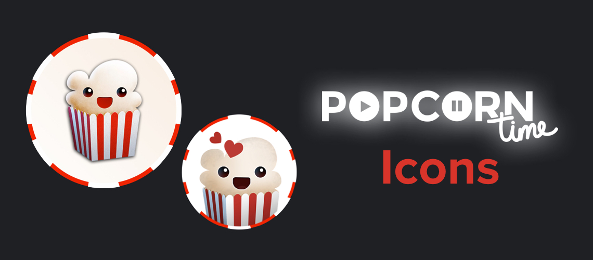
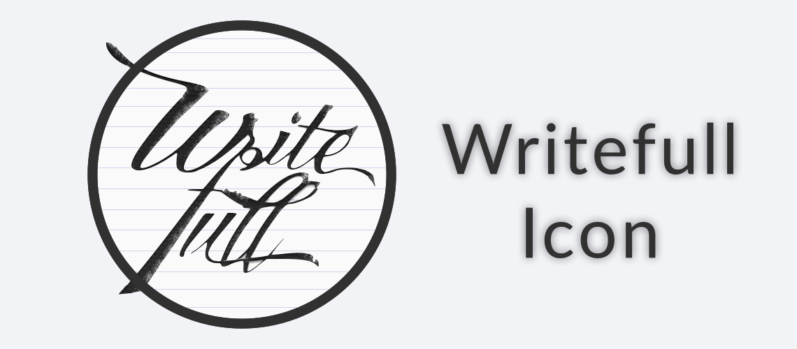

# old-icon-designs

  

Some old icon designs I've created in the past.

Mostly for macOS apps.

### Alchemize

### Blogo

### Popcorn Time

### Raindrop

### Writefull

## Usage

Use these icons for:

- Android
- Favicons
- Folder
- iOS
- macOS
- PNG
- Windows
- XCode

## Credits

- © [FVCproductions](http://fvcproductions.com)

## Donations

> Feed me... 🍕

